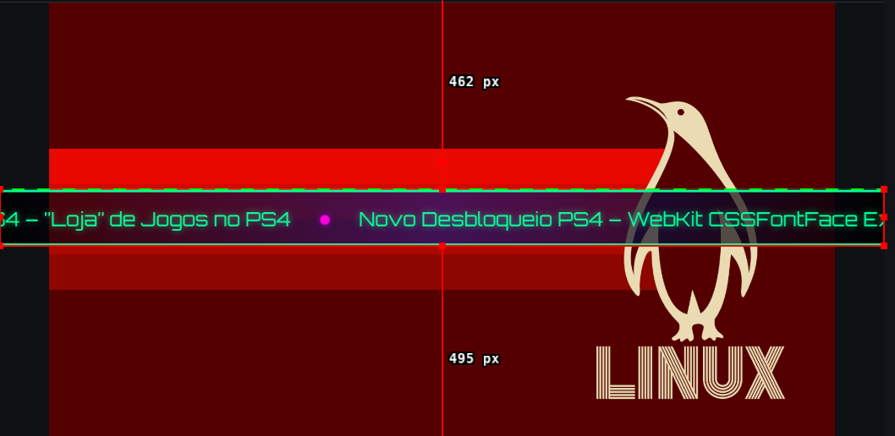

# RSS OBS LowerThird

Ticker RSS animado para OBS Studio com configurador visual, funcionando em Linux, Windows e macOS.

---

## Sobre este projeto

Esta criadora não é desenvolvedora de software. Este projeto foi desenvolvido com o uso do **Agent Hermes** com o modelo **nvidia/nemotron-3-ultra-550b-a55b:free**.

**Colaboradora**: Amielle (Amielle-Inside)

Baseado no projeto original **OBS_Ticker_v2** de **Derek-G1** (https://github.com/Derek-G1/OBS_Ticker_v2).

---

## Imagem de exemplo



---

## Instalação por plataforma

### Linux

#### Requisitos
- Python 3.6 ou superior
- systemd (para instalação como serviço, opcional)

#### Instalação rápida (teste)

```bash
# 1. Baixe ou clone o repositório
git clone https://github.com/Amielle-Inside/RSS-OBS-LowerThird.git
cd RSS-OBS-LowerThird

# 2. Dê permissão de execução ao script
chmod +x iniciar_ticker.sh

# 3. Execute
./iniciar_ticker.sh
```

#### Instalação como serviço (produção - inicia automaticamente no login)

```bash
# 1. Baixe ou clone o repositório
git clone https://github.com/Amielle-Inside/RSS-OBS-LowerThird.git
cd RSS-OBS-LowerThird

# 2. Copie o arquivo de serviço para a pasta do systemd do usuário
mkdir -p ~/.config/systemd/user
cp obs-ticker-server.service ~/.config/systemd/user/

# 3. Recarregue o systemd e ative o serviço
systemctl --user daemon-reload
systemctl --user enable --now obs-ticker-server.service
```

#### Verificar se está funcionando

```bash
# Ver status do serviço
systemctl --user status obs-ticker-server.service

# Ver logs em tempo real
journalctl --user -u obs-ticker-server.service -f

# Testar se o servidor responde
curl -s http://localhost:8082/ | head -5
```

#### Parar ou remover o serviço

```bash
# Parar e desativar
systemctl --user disable --now obs-ticker-server.service

# Remover arquivo de serviço
rm ~/.config/systemd/user/obs-ticker-server.service
systemctl --user daemon-reload
```

---

### Windows

#### Requisitos
- Python 3.6 ou superior
- **Importante**: Durante a instalação do Python, marque a opção **"Add Python to PATH"**

#### Instalação

1. Baixe o repositório:
   - Opção A: Clique em "Code" > "Download ZIP" no GitHub e extraia
   - Opção B: Use Git: `git clone https://github.com/Amielle-Inside/RSS-OBS-LowerThird.git`

2. Abra a pasta `RSS-OBS-LowerThird`

3. **Duplo clique** no arquivo `iniciar_ticker.bat`

   Ou, se preferir pelo prompt de comando:
   ```cmd
   cd C:\caminho\para\RSS-OBS-LowerThird
   python server.py --port 8082
   ```

#### Verificar se está funcionando

- Abra o navegador e acesse: `http://localhost:8082/configurator.html`
- Deve abrir o configurador visual

---

### macOS

#### Requisitos
- Python 3.6 ou superior
- Instale com Homebrew: `brew install python3`

#### Instalação

1. Baixe o repositório:
   - Opção A: Clique em "Code" > "Download ZIP" no GitHub e extraia
   - Opção B: Use Git: `git clone https://github.com/Amielle-Inside/RSS-OBS-LowerThird.git`

2. Abra o Terminal e vá até a pasta:
   ```bash
   cd ~/caminho/para/RSS-OBS-LowerThird
   ```

3. Dê permissão de execução e rode:
   ```bash
   chmod +x iniciar_ticker.command
   ./iniciar_ticker.command
   ```

   Ou clique duas vezes no arquivo `iniciar_ticker.command` no Finder (após dar permissão com `chmod +x`).

---

## Como usar

### 1. Acesse o configurador visual

Abra no navegador: **http://localhost:8082/configurator.html**

### 2. Personalize o ticker

No configurador você pode ajustar:

- **Paleta de Cores**: Cores do texto, bullets, brilho e borda com controle de transparência
- **Fundo**: Sólido, gradiente linear, radial ou cônico
- **Bordas**: Largura, arredondamento, 5 presets (quadrado a circular), estilos
- **Tipografia**: 8 fontes do Google Fonts + personalizada, tamanho, peso, espaçamento, sombra
- **Comportamento**: Velocidade, duração mínima, direção (esquerda/direita), pausa ao passar mouse, intervalo de atualização do RSS
- **Preview**: Visualização ao vivo que não reinicia a animação

### 3. Salve as alterações

Clique no botão **Salvar** (ícone de disquete) e selecione a pasta `RSS-OBS-LowerThird`.

### 4. Configure no OBS Studio

1. No OBS: **Adicionar Fonte** > **Browser Source** (Navegador)
2. **Desmarque** "Arquivo local" (Local file)
3. **URL**: `http://localhost:8082/`
4. **Largura**: 1920 (ou a largura do seu canvas)
5. **Altura**: 150 a 220 (ajuste conforme necessário)
6. **FPS**: 60
7. Clique em OK

### 5. Atualize o cache após mudanças

Sempre que mudar algo no configurador:
- Botão direito na fonte Browser Source no OBS
- **Propriedades**
- **Refresh cache of current page** (Atualizar cache da página atual)

---

## Configurar o feed RSS

O feed padrão é: `https://www.newsinside.org/feed/`

### Pelo configurador visual
1. Abra `http://localhost:8082/configurator.html`
2. Vá no painel **Comportamento**
3. Altere o campo **URL do RSS**
4. Salve

### Editando o arquivo diretamente
Edite `script.js` e altere:
```javascript
const CONFIG = {
    rssUrl: "https://SEU_FEED_AQUI/feed/",
    // ... outras configurações
};
```

> **Nota**: O projeto usa o serviço **rss2json.com** como proxy CORS (gratuito, sem chave). Funciona com qualquer feed RSS público.

---

## Estrutura de arquivos

```
RSS-OBS-LowerThird/
├── index.html                 # Ticker principal (OBS aponta aqui)
├── configurator.html          # Configurador visual (abra no navegador)
├── script.js                  # Lógica do ticker + configurações
├── style.css                  # Estilos (gerado pelo configurador)
├── server.py                  # Servidor HTTP Python (multiplataforma)
├── iniciar_ticker.sh          # Inicializador Linux
├── iniciar_ticker.bat         # Inicializador Windows
├── iniciar_ticker.command     # Inicializador macOS (duplo clique)
├── obs-ticker-server.service  # Serviço systemd (Linux)
├── exemplo.png                # Imagem de exemplo
└── README.md                  # Este arquivo
```

---

## Solução de problemas

| Sintoma | Causa | Solução |
|---------|-------|---------|
| "Error loading news feed" | Falha ao buscar RSS | Verifique `systemctl --user status obs-ticker-server` (Linux) ou console do navegador (F12) |
| Porta 8080 em uso | Steam ou outro app | Use porta 8082 (padrão) ou altere no comando/serviço |
| Feed não atualiza | Cache do OBS | Botão direito na fonte > Propriedades > Refresh cache of current page |
| Erro CORS | Usando `file://` | **Sempre use HTTP**: `http://localhost:8082/` |
| Cores invertidas | Extensão Dark Reader | Desative a extensão; o configurador tem proteção em 5 camadas |
| Fonte não carrega | Google Fonts bloqueado | Verifique conexão; há fallback para fontes do sistema |

---

## Créditos

- **Projeto original**: [OBS_Ticker_v2](https://github.com/Derek-G1/OBS_Ticker_v2) por **Derek-G1** (MIT License)
- **Proxy RSS**: [rss2json.com](https://rss2json.com/) - API gratuita para contornar CORS
- **Fontes**: Google Fonts (Orbitron, Rajdhani, Exo 2, Share Tech Mono, JetBrains Mono, Fira Code)

---

## Suporte

- **Issues no GitHub**: https://github.com/Amielle-Inside/RSS-OBS-LowerThird/issues
- **Telegram**: https://t.me/newsinsidechat

---

## Licença

MIT - Baseado no [OBS_Ticker_v2](https://github.com/Derek-G1/OBS_Ticker_v2) por Derek-G1.